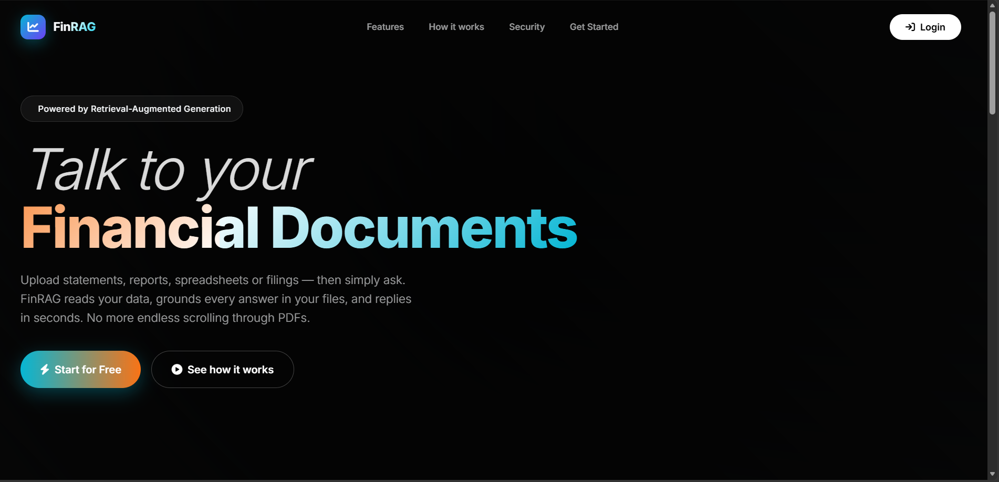
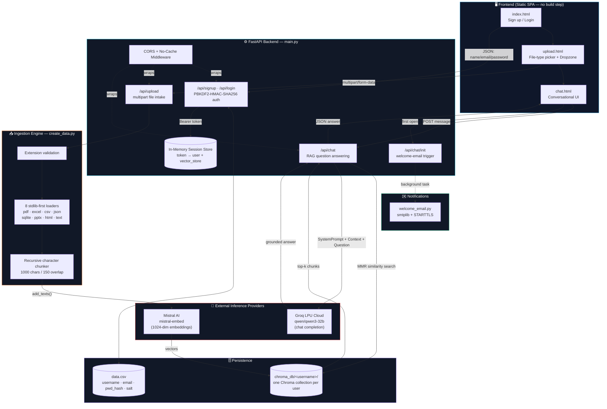
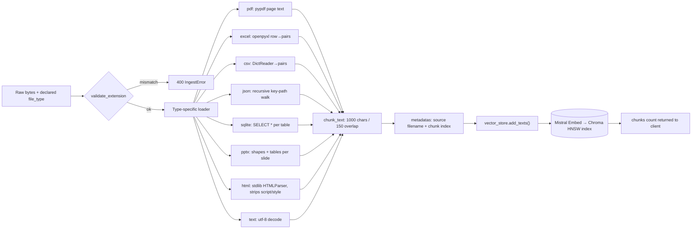
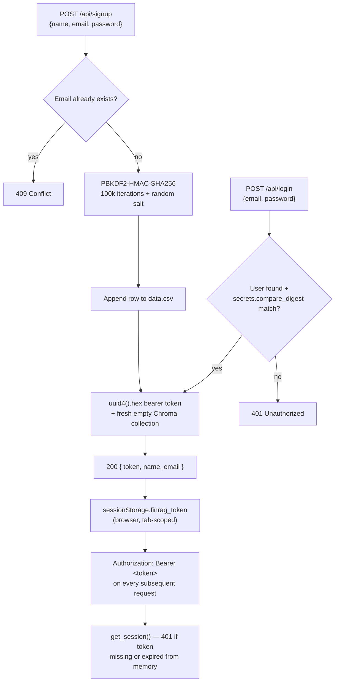
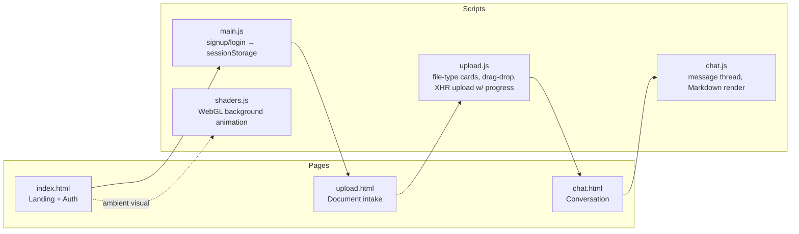

<div align="center">



# FinRAG

### Retrieval-Augmented Generation for Financial Documents

**Upload a statement, report, spreadsheet, or filing — and have a grounded, cited conversation about what's actually inside it.**

[](https://www.python.org/)
[](https://fastapi.tiangolo.com/)
[](https://www.langchain.com/)
[](https://www.trychroma.com/)
[](https://groq.com/)
[](https://mistral.ai/)
[](#license)

</div>

---

## Table of Contents

1. [Overview](#1-overview)
2. [System Architecture](#2-system-architecture)
3. [The RAG Pipeline — Deep Dive](#3-the-rag-pipeline--deep-dive)
4. [Backend Reference (`main.py`)](#4-backend-reference-mainpy)
5. [Ingestion Engine (`create_data.py`)](#5-ingestion-engine-create_datapy)
6. [Authentication & Session Model](#6-authentication--session-model)
7. [Transactional Email (`welcome_email.py`)](#7-transactional-email-welcome_emailpy)
8. [Frontend Overview](#8-frontend-overview)
9. [Project Structure](#9-project-structure)
10. [Tech Stack](#10-tech-stack)
11. [Getting Started](#11-getting-started)
12. [Environment Variables](#12-environment-variables)
13. [API Reference](#13-api-reference)
14. [Security Notes & Known Limitations](#14-security-notes--known-limitations)
15. [Roadmap](#15-roadmap)
16. [License](#16-license)

---

## 1. Overview

**FinRAG** is a full-stack Retrieval-Augmented Generation (RAG) application purpose-built for financial documents. A user signs up, uploads one or more documents (PDF, Excel, CSV, JSON, SQLite, PowerPoint, HTML, or plain text), and the system chunks and embeds that content into a private, per-user vector store. From there, the user chats with an AI financial-analyst persona ("FinSight") that answers **exclusively from retrieved document context**, refuses to fabricate figures, and clearly labels anything that is general financial knowledge rather than something pulled from the file itself.

The project is deliberately split into two independent halves:

| Layer | Responsibility | Stack |
|---|---|---|
| **Backend** | Auth, file ingestion, chunking, embeddings, vector retrieval, LLM orchestration, transactional email | FastAPI + LangChain + ChromaDB + Groq + Mistral |
| **Frontend** | Landing page, sign-up/login, drag-and-drop upload UX, chat interface | Static HTML/CSS/vanilla JS (no framework, no build step) |

The backend is the focus of this document, as it contains all of the RAG logic, security boundaries, and business rules. The frontend is a thin, static client that talks to the backend exclusively over a small, versioned JSON REST API.

---

## 2. System Architecture

The diagram below shows the full request lifecycle, from the browser down to the two external AI providers.



**Key architectural decisions:**

- **Per-user vector isolation.** Each user gets a dedicated Chroma collection at `chroma_db/<username>/`, so one user's documents are never retrievable by another user's queries — there is no shared global index.
- **Lazy, single-flight model clients.** `MistralAIEmbeddings` and `ChatGroq` are instantiated once (module-level singletons via `get_embedding_model()` / `get_chat_model()`) and reused across every request, avoiding the cost of re-authenticating per call.
- **Loader/orchestrator split.** `create_data.py` has **zero LangChain imports** by design — it is pure stdlib plus light optional parsers (`pypdf`, `openpyxl`, `python-pptx`). This keeps ingestion cheap to cold-start and testable in isolation from the LLM stack.
- **Backend serves the frontend.** `StaticFiles` is mounted at `/` as the *last* route in `main.py`, so every `/api/*` route takes priority and the static file server acts as a catch-all for the SPA — one process, one port, zero CORS friction in production.

---

## 3. The RAG Pipeline — Deep Dive

This sequence diagram traces exactly what happens between a user typing a question and receiving a grounded answer.

```mermaid
sequenceDiagram
    autonumber
    participant U as User (chat.html)
    participant F as FastAPI /api/chat
    participant C as Chroma (per-user collection)
    participant M as Mistral Embed
    participant G as Groq (Qwen3-32B)

    U->>F: POST /api/chat { message }
    F->>F: get_session(Authorization header)
    alt no documents uploaded yet
        F-->>U: 400 "Please upload a document first"
    end
    F->>C: as_retriever(search_type="mmr", k=6, fetch_k=15, λ=0.5)
    Note over F,C: Maximal Marginal Relevance balances<br/>relevance vs. diversity of chunks
    C->>M: embed the incoming question
    M-->>C: query vector
    C->>C: ANN search over HNSW index
    C-->>F: top-6 diverse, relevant chunks
    alt no relevant chunks found
        F-->>U: "I couldn't find that in the document."
    end
    F->>F: join chunks into &lt;document_context&gt;
    F->>F: build [SystemMessage(FinSight persona), HumanMessage(context+question)]
    F->>G: chat.invoke(messages)
    Note over G: Grounding rules enforced via system prompt:<br/>no fabricated figures, cite the doc,<br/>label outside knowledge explicitly
    G-->>F: Markdown-formatted analysis
    F-->>U: 200 { answer }
```

### Ingestion pipeline (what happens on upload)



**Why chunking is overlap-based:** `chunk_text()` slides a 1000-character window forward with a 150-character overlap so that a sentence or figure that straddles a chunk boundary is never fully lost from either neighbor — this materially improves MMR recall on numeric tables and financial statements, where a single line item ("Total Revenue: $4.2M") can otherwise be split across two chunks.

---

## 4. Backend Reference (`main.py`)

`main.py` is the single FastAPI application entry point. It is organized top-to-bottom as:

| Section | Purpose |
|---|---|
| **Imports & warm-up** | Heavy LangChain / LangChain-Mistral / LangChain-Groq imports happen exactly once at process start, not per-request. |
| **`SYSTEM_PROMPT`** | The full "FinSight" persona — grounding rules, analytical toolkit, tone, guardrails, and a strict GitHub-Flavored-Markdown output contract (headings, tables, key-takeaways, bolded figures) so the frontend can render rich responses without a Markdown-detection heuristic. |
| **Tiny CSV "database"** | `_read_users` / `_write_users` / `create_user` / `find_user_by_email`, guarded by a `threading.Lock` for concurrent-write safety. |
| **Password hashing** | PBKDF2-HMAC-SHA256, 100,000 iterations, per-user random salt (`secrets.token_hex(16)`), constant-time comparison via `secrets.compare_digest`. |
| **Pydantic models** | `SignupRequest`, `LoginRequest`, `AuthResponse`, `ChatRequest`, `ChatResponse`, `UploadResponse`, and a `FileType` `Enum` that is the single source of truth shared with `create_data.FILE_TYPES`. |
| **Session store** | `SESSIONS: Dict[str, dict]` — an in-memory map from opaque bearer token → `{ username, name, email, vector_store, files[], welcomed }`. |
| **Model factories** | `get_embedding_model()` / `get_chat_model()` — singleton getters that raise a clean `HTTPException(500)` if the relevant API key is missing, rather than crashing at import time. |
| **Middleware** | Permissive CORS (frontend and backend are same-origin in production, but this eases local dev) + a custom `NoCacheStaticMiddleware` that forces `Cache-Control: no-store` on `.html/.js/.css` so frontend iteration never fights the browser cache. |
| **Routes** | See [§13 API Reference](#13-api-reference) below. |
| **Static mount** | `app.mount("/", StaticFiles(...))` is registered **last**, guaranteeing `/api/*` always wins route resolution. |

---

## 5. Ingestion Engine (`create_data.py`)

A self-contained, framework-agnostic module. Its only job is: **bytes in → clean, embedded chunks out.**

- **`FILE_TYPES` registry** — the canonical id → label/extension mapping, mirrored 1:1 by the 8 file-type cards rendered in `frontend/js/upload.js`.
- **`validate_extension()`** — rejects a mismatch between the extension a user selected on the upload card and the extension of the file they actually dropped, closing an easy spoofing/confusion vector before any parser touches the bytes.
- **Eight independent loaders**, each taking raw `bytes` and returning `list[str]` of logical sections:

  | File type | Library | Notes |
  |---|---|---|
  | `pdf` | `pypdf` | Per-page text extraction |
  | `excel` | `openpyxl` | Row → `"header: value"` pairs, per sheet, `data_only=True` to resolve formula results |
  | `csv` | stdlib `csv` | `DictReader` rows packed into ~1000-char blocks |
  | `json` | stdlib `json` | Recursive key-path walker (`a.b[2].c: value`) so nested structures stay queryable |
  | `sqlite` | stdlib `sqlite3` | Writes to a scratch temp file (sqlite3 needs a real path), iterates every table, always cleans up in a `finally` |
  | `ppt` | `python-pptx` | Extracts text frames *and* table cells, per slide |
  | `html` | stdlib `HTMLParser` | Custom minimal parser strips `<script>`/`<style>`, zero third-party HTML dependency |
  | `text` | stdlib | UTF-8 decode with `errors="replace"` |

- **`ingest_file()`** is the single public entry point called from `/api/upload`: validate → load → chunk → attach `{source, chunk}` metadata → `vector_store.add_texts()` → return chunk count. Every failure mode raises `IngestError`, which `main.py` catches and turns into a clean `400`.

---

## 6. Authentication & Session Model



- Sessions are **process-memory only** — restarting the backend invalidates every logged-in user, and there is no horizontal-scaling story without moving `SESSIONS` to Redis/Postgres.
- Every session owns exactly one live `Chroma` handle, created once at login/signup via `build_vector_store(username)` and reused for every upload and every chat turn in that session.
- The `data.csv` "database" is intentionally minimal (username, name, email, password_hash, salt) — appropriate for a prototype/demo, not a production user store (see [§14](#14-security-notes--known-limitations)).

---

## 7. Transactional Email (`welcome_email.py`)

A pure-stdlib module (`smtplib` + `email.mime`) with **zero LangChain/FastAPI imports**, so it can be imported cheaply and fired from a FastAPI `BackgroundTasks` job without adding latency to the request that triggered it.

- Triggered exactly once per user, the first time `/api/chat/init` is called (guarded by the `session["welcomed"]` flag).
- Sends a responsive, table-based HTML email (Outlook/Gmail-safe MSO conditional comments, gradient hero text with graceful fallback color) plus a plain-text alternative part.
- `is_email_configured()` checks that SMTP credentials exist before attempting a send; if they don't, the function logs and returns `False` rather than throwing — **a missing SMTP config can never break login or chat.**
- Connects over STARTTLS on port 587 using `ssl.create_default_context()` for certificate verification.

---

## 8. Frontend Overview

The frontend is intentionally framework-free: three static HTML pages, vanilla JS modules, and hand-written CSS — no bundler, no `npm install`, no build step. It is served directly by FastAPI's `StaticFiles`.



| Page | Responsibility |
|---|---|
| `index.html` | Landing hero (see screenshot above) + sign-up/login forms. On success, stores the bearer token in `sessionStorage` and redirects to the uploader. |
| `upload.html` | Eight interactive file-type cards → drag-and-drop dropzone → `XMLHttpRequest` upload with a real byte-progress bar wired to `xhr.upload.onprogress`, capped at 95% until the server confirms ingestion. |
| `chat.html` | Renders the FinSight conversation, including the structured Markdown contract from the system prompt (tables, key-takeaway lists, section dividers). |

All three pages share one contract with the backend: an `Authorization: Bearer <token>` header on every authenticated call, and a hard redirect back to `index.html` whenever a call returns `401`.

---

## 9. Project Structure

```
Finace_report_anayser/
├── main.py                  # FastAPI app: auth, upload, chat routes, model singletons
├── create_data.py           # Stdlib-first ingestion engine (8 file-type loaders)
├── welcome_email.py         # smtplib welcome email, fired as a background task
├── requirements.txt         # Backend dependencies (pinned)
├── data.csv                 # Flat-file user store (auto-created on first signup)
├── .env / .env.example      # MISTRAL_API_KEY, GROQ_API_KEY, SMTP_* secrets
├── chroma_db/                # One persisted Chroma collection per <username>
│   └── <username>/…
├── tmp_uploads/              # Scratch dir for the sqlite loader's temp file
├── screenshots/              # README image assets
│   └── homepage-hero.png
└── frontend/
    ├── index.html
    ├── upload.html
    ├── chat.html
    ├── css/style.css
    └── js/
        ├── main.js
        ├── upload.js
        ├── chat.js
        └── shaders.js
```

---

## 10. Tech Stack

| Concern | Choice | Why |
|---|---|---|
| API framework | **FastAPI** + **Uvicorn** | Async-ready, Pydantic-native validation, auto-generated OpenAPI docs at `/docs` |
| Orchestration | **LangChain** (`langchain-core`, `langchain-community`) | Standardized `Retriever` / `VectorStore` interfaces decoupled from any one provider |
| Embeddings | **Mistral AI** — `mistral-embed` | High-quality, low-latency embedding endpoint via `langchain-mistralai` |
| Vector store | **ChromaDB** (persistent, local, HNSW index) | Zero external infra — a folder on disk is the entire "database" |
| Chat / generation | **Groq** — `qwen/qwen3-32b` | LPU-accelerated inference for near-instant token throughput |
| Auth | **PBKDF2-HMAC-SHA256** (stdlib `hashlib`/`secrets`) | No external auth provider dependency for a prototype-scale app |
| User store | **CSV** (stdlib `csv`) | Deliberately simple; swap for Postgres/SQLite when moving beyond a demo |
| Email | **smtplib** (stdlib) | No third-party email SDK required |
| Frontend | **Vanilla HTML/CSS/JS** | No build step, instant iteration, trivially served as static files |

---

## 11. Getting Started

### Prerequisites
- Python 3.11+ (developed/tested on 3.13)
- A [Mistral AI](https://console.mistral.ai/) API key (embeddings)
- A [Groq](https://console.groq.com/) API key (chat completion)
- (Optional) SMTP credentials for the welcome email — Gmail App Password works out of the box

### Installation

```bash
# 1. Clone the repository
git clone https://github.com/<your-username>/finrag.git
cd finrag/Finace_report_anayser

# 2. Create and activate a virtual environment
python -m venv venv
source venv/bin/activate          # Windows: venv\Scripts\activate

# 3. Install backend dependencies
pip install -r requirements.txt

# 4. Configure environment variables
cp .env.example .env
# then edit .env and add MISTRAL_API_KEY, GROQ_API_KEY, and (optionally) SMTP_*

# 5. Run the server
uvicorn main:app --reload
```

The app is now live at **`http://127.0.0.1:8000`** — the backend serves the frontend directly, so there is nothing else to start.

### Quick smoke test

```bash
curl http://127.0.0.1:8000/api/health
# → {"status":"ok"}
```

---

## 12. Environment Variables

| Variable | Required | Description |
|---|---|---|
| `MISTRAL_API_KEY` | ✅ | Used by `MistralAIEmbeddings` for document + query embedding |
| `GROQ_API_KEY` | ✅ | Used by `ChatGroq` for the RAG chat completion |
| `SMTP_HOST` | optional | Defaults to `smtp.gmail.com` |
| `SMTP_PORT` | optional | Defaults to `587` (STARTTLS) |
| `SMTP_USERNAME` | optional | Mailbox username used to authenticate |
| `SMTP_PASSWORD` | optional | App password (never your real account password) |
| `FROM_EMAIL` | optional | Defaults to `SMTP_USERNAME` |
| `FROM_NAME` | optional | Defaults to `FinRAG` |

If SMTP variables are omitted, the app runs perfectly fine — the welcome email is silently skipped and logged to stdout.

---

## 13. API Reference

Base URL: `http://127.0.0.1:8000`

| Method | Endpoint | Auth | Body | Description |
|---|---|---|---|---|
| `GET` | `/api/health` | — | — | Liveness probe → `{"status":"ok"}` |
| `GET` | `/api/file-types` | — | — | Returns the `FILE_TYPES` registry (drives the upload UI) |
| `POST` | `/api/signup` | — | `{name, email, password}` | Creates a user, hashes the password, returns a bearer token |
| `POST` | `/api/login` | — | `{email, password}` | Verifies credentials, returns a bearer token |
| `POST` | `/api/logout` | Bearer | — | Drops the session from memory |
| `GET` | `/api/session` | Bearer | — | Returns `{name, email, files[]}` for the current session |
| `POST` | `/api/upload` | Bearer | `multipart/form-data: file_type, file` | Validates, parses, chunks, embeds, and stores the document |
| `POST` | `/api/chat/init` | Bearer | — | Marks the session "welcomed" and fires the welcome email once |
| `POST` | `/api/chat` | Bearer | `{message}` | Runs MMR retrieval + LLM generation, returns `{answer}` |

Interactive Swagger docs are auto-generated by FastAPI at **`/docs`** and ReDoc at **`/redoc`** once the server is running.

---

## 14. Security Notes & Known Limitations

This project is architected as a focused RAG demonstration, not a hardened production system. Before deploying beyond a personal/demo environment, address the following:

- **In-memory sessions.** `SESSIONS` lives in a process dict — it does not survive a restart and cannot be shared across multiple worker processes. Move to a shared store (Redis, database-backed JWTs) for anything multi-instance.
- **Flat-file user store.** `data.csv` has no row-level locking beyond a single `threading.Lock`, no encryption at rest, and does not scale past a small number of users. Swap for a real database before production use.
- **Permissive CORS.** `allow_origins=["*"]` is convenient for local development but should be scoped to your actual frontend origin(s) in production.
- **25 MB upload cap** (`MAX_UPLOAD_BYTES`) is enforced server-side but should be paired with a reverse-proxy-level limit (e.g., Nginx `client_max_body_size`) in production.
- **No rate limiting** is implemented on `/api/login`, `/api/signup`, or `/api/chat` — add a layer (e.g., `slowapi`) before public exposure.
- **Bearer tokens never expire.** There is currently no TTL/refresh mechanism on session tokens.

---

## 15. Roadmap

- [ ] Persistent user store (PostgreSQL) + Alembic migrations
- [ ] JWT-based auth with refresh tokens and expiry
- [ ] Streaming chat responses (Server-Sent Events) instead of a single blocking call
- [ ] Multi-document cross-referencing within a single conversation
- [ ] Source-chunk highlighting in the UI (click an answer → jump to the exact retrieved passage)
- [ ] Dockerfile + docker-compose for one-command deployment
- [ ] Automated test suite (pytest) covering loaders, auth, and the retrieval contract

---

## 16. License

Distributed under the **MIT License**. See `LICENSE` for details.

---

<div align="center">

Built with FastAPI, LangChain, ChromaDB, Mistral AI, and Groq.

</div>
